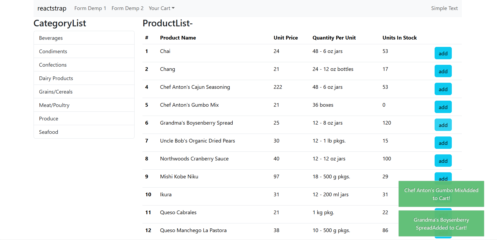
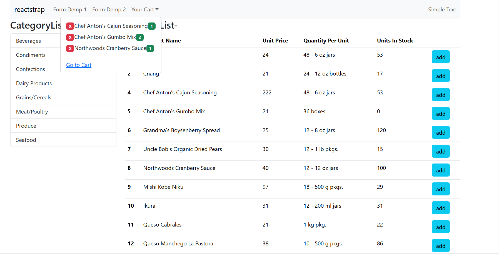
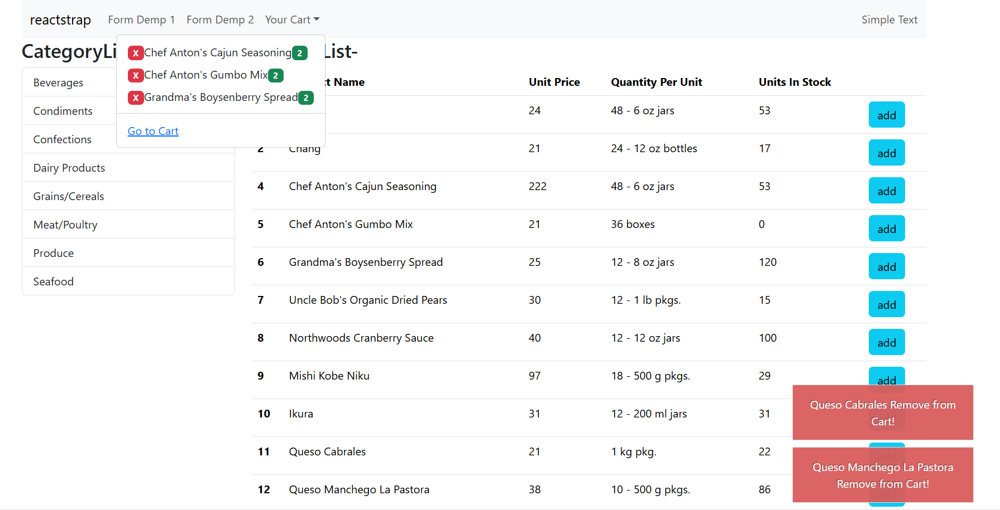
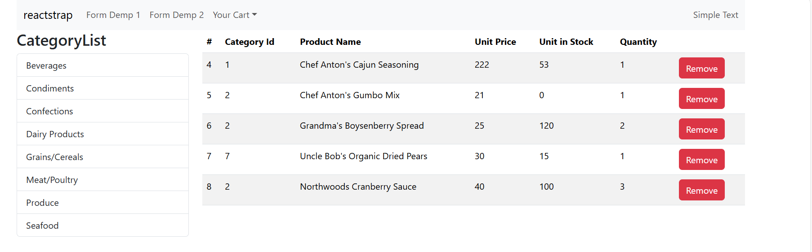
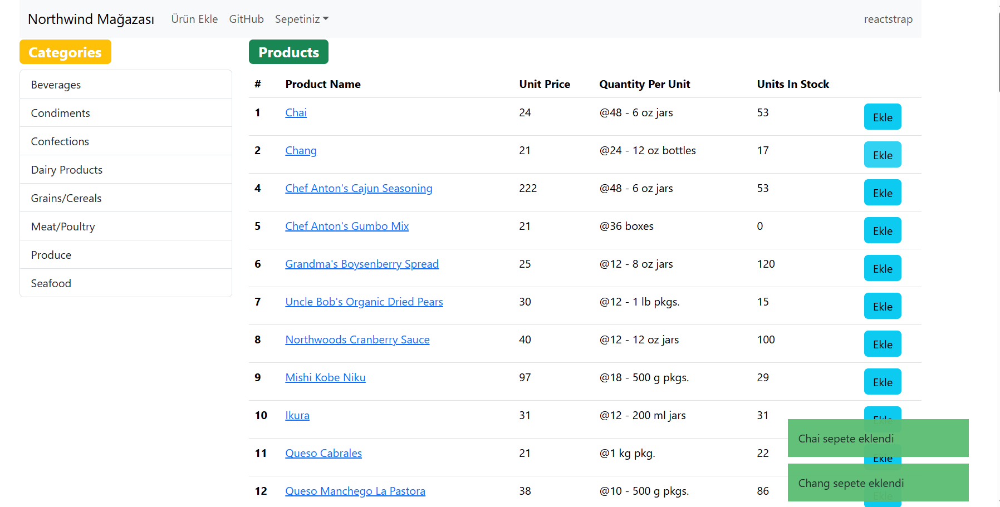
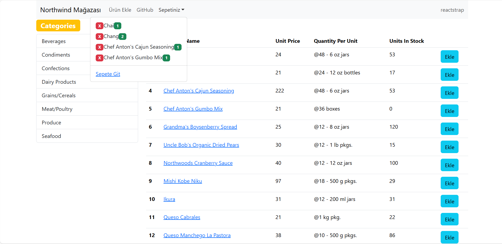
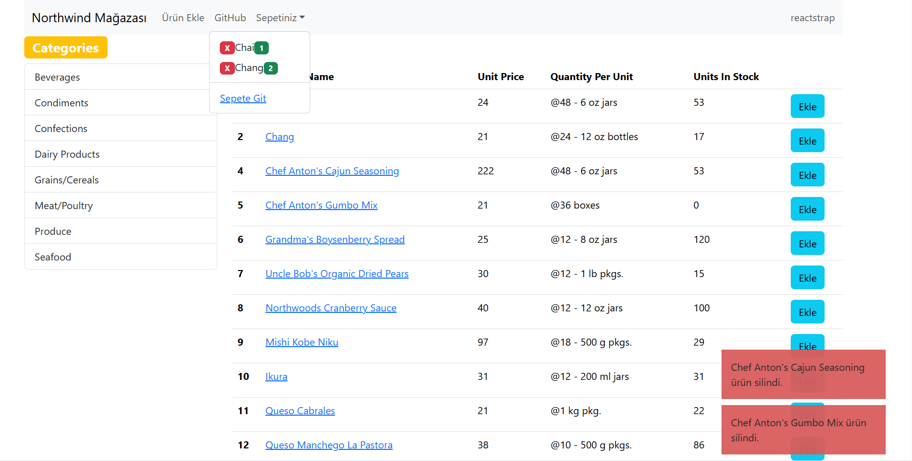
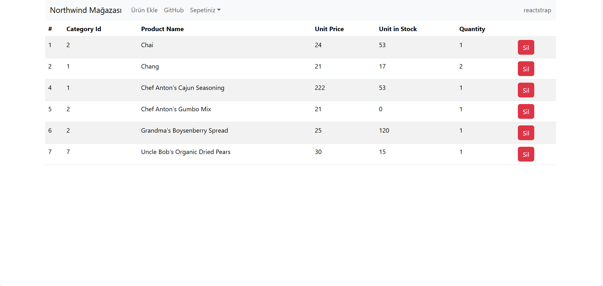
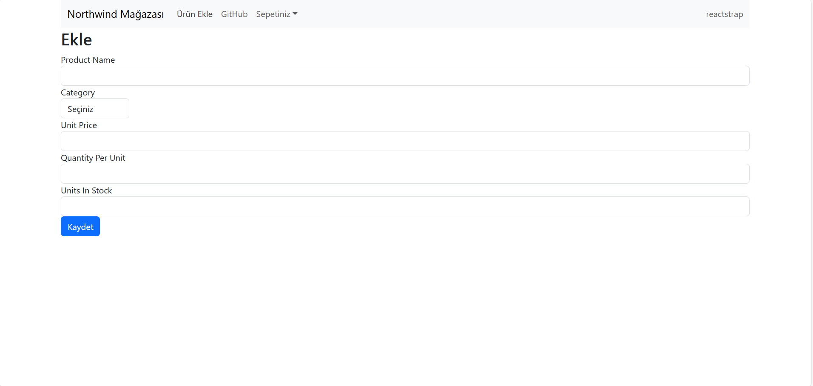

```
npm install -g create-react-app
npx create-react-app project_name
cd project_name
npm start
```

<b>NOTE:</b> Class components are created using the rcc shortcut.

<h3>intro</h3>

```
npx create-react-app intro
npm install reactstrap
npm install bootstrap
npm install alertifyjs
npm install react-router-dom
npm install -g json-server
```

<b>NOTE:</b> You can also install it by writing it inside the dependencies section of the package.json.

<table>
    <tr>
        <th>react-router-dom v5</th>
        <th>react-router-dom v6 v7</th>
    </tr>
    <tr>
        <td>Switch	</td>
        <td>Routes</td>
    </tr>
    <tr>
        <td>component</td>
        <td>element</td>
    </tr>
    <tr>
       <td>&lt;Route path="/a" component={A} /&gt;</td>
       <td>&lt;Route path="/a" element={&lt;A /&gt;} /&gt;</td> 
    </tr>
</table>
<br/>


```
json-server --watch db.json (localhost:3000)
npm start  (localhost:3001)
```







<h3>redux-intro</h3>
<b>NOTE:</b> Counter Application

```
npx create-react-app redux-intro
npm install redux
npm install react-redux
```

<h3>northwind-redux</h3>

```
npx create-react-app northwind-redux
npm install redux
npm install react-redux
npm install reactstrap
```

<table>
    <tr>
        <th>react-router-dom v5</th>
        <th>react-router-dom v6 v7</th>
    </tr>
    <tr>
        <td>useHistory</td>
        <td>useNagivate</td>
    </tr>
    <tr>
        <td>history.push("/home");</td>
        <td>const navigate = useNavigate();<br />navigate("/home");</td>
    </tr>
    <tr>
       <td>Route Props removed <br /> (match,location,history)</td>
       <td>Hooks are mandatory <br /> useParams(),useLocation(),useNavigate()</td> 
    </tr>
 </table>
 <br/>








SOURCE

https://reactstrap.github.io/?path=/story/home-installation--page

https://github.com/typicode/json-server

https://www.geeksforgeeks.org/node-js/json-server-setup-and-introduction/

https://alertifyjs.com/
